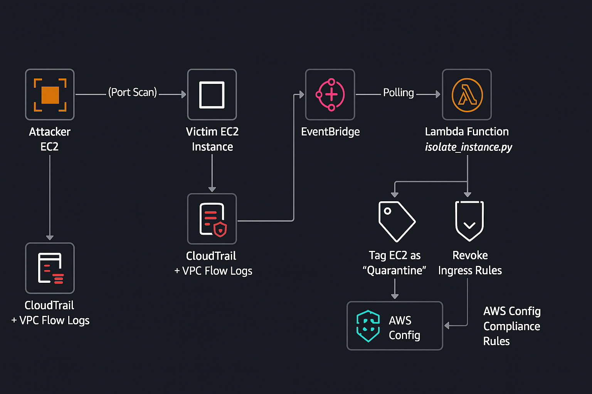

# 🛡️ AWS Cloud Threat Detection & Response Lab

This lab simulates real-world cloud security incidents and demonstrates automated threat detection and response using AWS-native services. Infrastructure is provisioned with Terraform and integrates GuardDuty, AWS Config, Security Hub, CloudTrail, and Lambda.

> ⚙️ Designed as a portfolio project to showcase hands-on cloud security and DevSecOps engineering skills.

---

## 🚀 Key Features

- **Infrastructure as Code (IaC)** using Terraform
- **AWS GuardDuty** detects port scans and other suspicious behavior
- **AWS Lambda** automatically isolates compromised EC2 instances
- **AWS Config** enforces compliance with encryption and network hardening rules
- **Security Hub** aggregates and visualizes findings
- **MITRE ATT&CK-aligned threat simulation**

---

## 🧰 Tech Stack

| Tool            | Purpose                         |
|-----------------|----------------------------------|
| Terraform       | Infrastructure provisioning      |
| AWS EC2         | Target + attacker VMs            |
| AWS GuardDuty   | Threat detection                 |
| AWS Lambda      | Automated incident response      |
| AWS Config      | Compliance monitoring            |
| AWS Security Hub| Aggregation + visualization      |
| Python (Boto3)  | Lambda scripting                 |
| EventBridge     | Event-driven automation          |

---

## 🗺️ Architecture



> *This diagram shows the flow from threat detection → Lambda response → EC2 isolation.*

---

## 🧱 Project Structure

```

aws-threat-detection-lab/
├── terraform/            # IaC files for full lab
│ ├── main.tf
│ ├── lambda.tf
│ ├── config.tf
│ ├── securityhub.tf
│ ├── variables.tf
│ ├── outputs.tf
├── lambda/
│ └── isolate_instance.py # Python auto-remediation logic
├── attack_simulation/
│ └── nmap_scan.md        # Simulate port scan
├── diagrams/
│ └── architecture.png    # Optional visual
├── teardown.sh           # Script to destroy all resources
├── README.md
└── .gitignore

````

---

## 🧪 Lab Walkthrough

### 1. Clone and Deploy the Lab

```bash
git clone https://github.com/N0-R4NS0M/aws-threat-detection-lab.git
cd aws-threat-detection-lab/terraform

# (Optional) Update variables.tf with your AWS region and EC2 key pair

terraform init
terraform apply
```

Terraform will provision:

* A VPC, EC2 instance, and basic networking
* GuardDuty, AWS Config, and Security Hub
* A Lambda function that auto-remediates threats

---

### 2. Simulate a Threat

Follow the instructions in `attack_simulation/nmap_scan.md` to simulate a port scan attack from another EC2 instance.

---

### 3. Observe the Response

* GuardDuty will generate a finding
* EventBridge triggers the Lambda function
* The Lambda:

  * Tags the suspicious EC2 as `Quarantine`
  * Removes its ingress rules to isolate it

---

### 4. Teardown the Lab

To safely destroy all AWS resources and avoid charges:

```bash
cd aws-threat-detection-lab
./teardown.sh
```

> 💡 If the script isn’t executable, run `chmod +x teardown.sh` first.

---

## 📸 Screenshots

* ✅ GuardDuty Finding
* ✅ Lambda execution logs
* ✅ Quarantined EC2 tags
* ✅ Security Hub summary

---

## 🎯 Skills Demonstrated

* Cloud Security Engineering (GuardDuty, Config, IAM, Security Hub)
* DevSecOps Automation with Terraform + Lambda
* Incident Response (detection → action flow)
* AWS Governance & Compliance (CIS, NIST)
* Real-world threat simulation with MITRE ATT\&CK mapping

---

## 👋 Author

**Aaron Diaz**
🔗 [LinkedIn](https://linkedin.com/in/aaron918)

---

## 📝 License

This lab is for educational and portfolio use only. Use responsibly.
